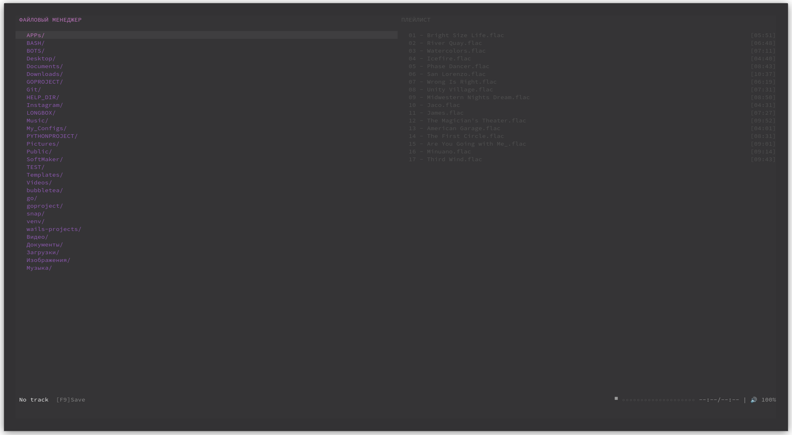
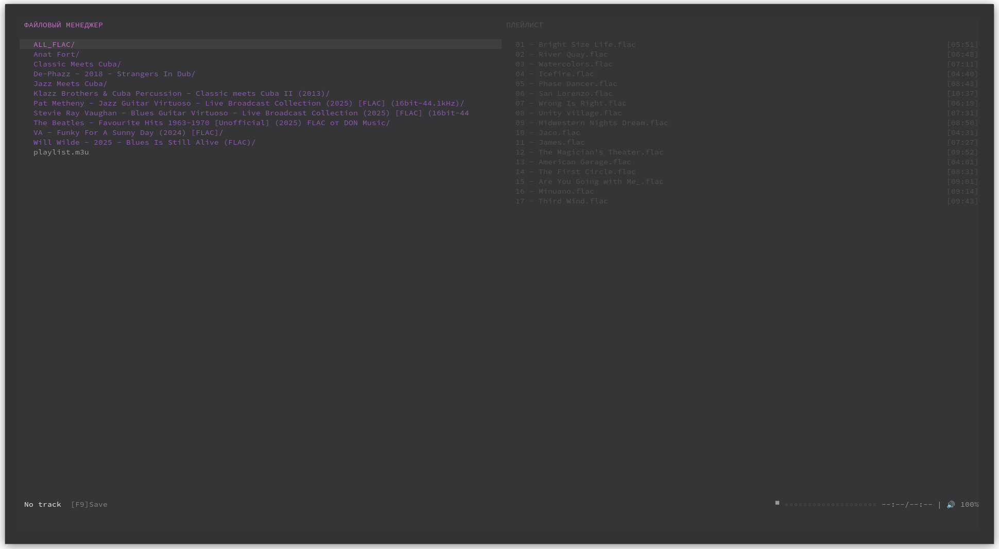
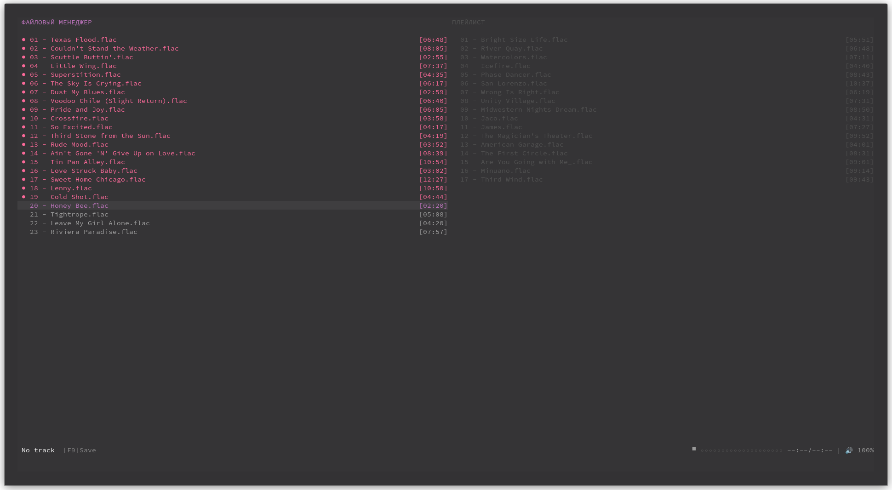
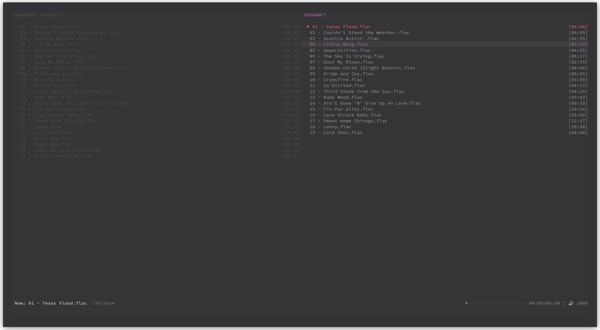
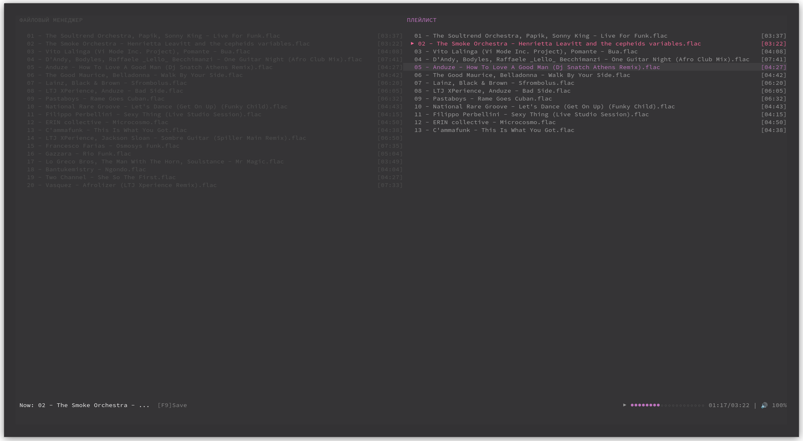

# Hi-Res Player 🎵

TUI (Text User Interface) аудио плеер для настоящих ценителей Hi-Res звука. Написан на Rust с использованием ratatui.







## ✨ Особенности

- 🎧 Поддержка Hi-Res аудио форматов (FLAC, WAV, DSD)
- 🎨 Красивый TUI интерфейс с подсветкой
- 📁 Файловый менеджер с навигацией
- 🎵 Управление плейлистами (M3U)
- ⚡ Быстрый и легкий (благодаря Rust)
- 🖥️ Работает в терминале

## 🚀 Установка

### Требования

- Rust 1.70+ 
- ALSA (Linux) / CoreAudio (macOS) / WASAPI (Windows)

### Установка из исходников

```bash
cargo install hi-res-player
```

Или собери самостоятельно

```
git clone https://github.com/твой-username/hi-res-player.git
cd hi-res-player
cargo build --release
```

## 🎮 Использование

### Запуск с указанием папки

```
hi-res-player /path/to/music
```

### Или переход в папку и запуск

```
cd /path/to/music
hi-res-player
```

## Горячие клавиши

Клавиша    Действие
- F1    Справка
- F2    Воспроизведение
- F3    Пауза
- F4    Стоп
- F5    Предыдущий трек
- F6    Следующий трек
- F9    Сохранить плейлист
- Tab    Переключение между панелями
- ↑/↓    Навигация
- →    Войти в папку/добавить в плейлист
- ←    Выйти из папки
- Enter    Добавить в плейлист
- Delete    Удалить из плейлиста
- +/-    Громкость

### 📦 Поддерживаемые форматы

FLAC, WAV, MP3, OGG, M4A, AAC

DSD (DSF, DFF)

Плейлисты M3U

🛠️ Разработка

## Клонирование и запуск для разработки

git clone https://github.com/твой-username/hi-res-player.git
cd hi-res-player
cargo run

## Запуск тестов

cargo test

## 🗺️  Roadmap

Базовое воспроизведение

Улучшение обработки ошибок

TUI спектр-анализатор

Поддержка сетевых потоков

## 🤝 Участие в разработке

Баги и фич-реквесты приветствуются! Создавайте issue или pull request.

## 📄 Лицензия

MIT License - смотри файл LICENSE

```

```
